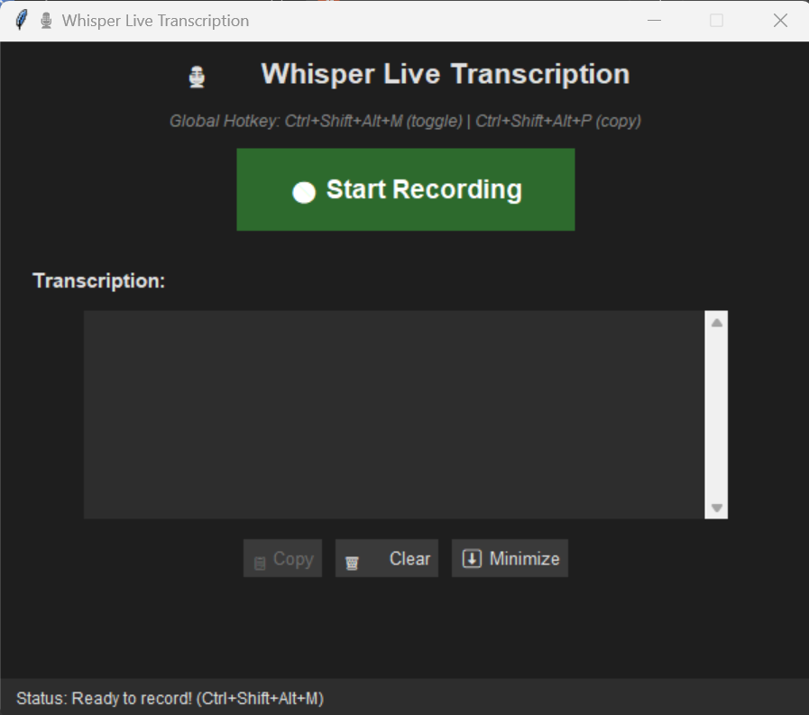

# Whisper OpenVINO Transcriber

A fast, local speech-to-text application powered by OpenAI's Whisper model optimized with Intel OpenVINO for efficient GPU inference.

## Features

- 🎤 **Real-time transcription** with global hotkeys
- ⚡ **Fast processing** (~1-2 seconds per transcription using Intel Arc GPU)
- 🔒 **Completely local** - no internet required, privacy-focused
- 📋 **Easy copying** - auto copies text to clipboard
- 🌐 **Global hotkeys** - control from anywhere while minimized to system tray



## System Requirements

- **Windows** (tested on Windows 11)
- **Python 3.11** (recommended)
- **Intel Arc GPU** or compatible OpenVINO device
- **FFmpeg** installed and in system PATH

## Installation

### 1. Install FFmpeg

Download and install FFmpeg from [ffmpeg.org](https://ffmpeg.org/download.html) and add it to your system PATH.

### 2. Clone the repository
```bash
git clone https://github.com/jaybutch/whisper-openvino-transcriber.git
cd whisper-openvino-transcriber
```

### 3. Create a virtual environment
```bash
python -m venv whisper_env
whisper_env\Scripts\activate  # On Windows
```

### 4. Install dependencies
```bash
pip install -r requirements.txt
```

### 5. Convert the Whisper model

Run the conversion script to create the OpenVINO optimized model:
```bash
python convert_whisper.py
```

This will download the Whisper Base model and convert it to OpenVINO format in the `whisper-base-openvino/` directory.

## Usage

### Running the Application
```bash
python whisper_transcriber.py
```

### Controls

**In-App:**
- Click the **Record** button to start/stop recording
- **Copy** button copies transcription to clipboard
- **Clear** button clears the transcription
- **Minimize to Tray** keeps the app running in background

**Global Hotkey:**
- `F9` - Start/stop recording from anywhere

**System Tray:**
- Right-click the tray icon for quick access
- Options: Show Window, Record, Copy, Quit

## Technical Details

### Model Configuration
- **Model**: Whisper Base (OpenVINO optimized)
- **Device**: Intel Arc integrated GPU (GPU.0)
- **Language**: English
- **Format**: OpenVINO IR with dynamic shapes
- **Performance**: ~1 second transcription time

### Audio Settings
- **Sample Rate**: 16kHz
- **Channels**: Mono
- **Capture**: PyAudio

## Troubleshooting

### GPU Device Issues

If you encounter GPU errors, you can check available devices:
```python
from openvino.runtime import Core
core = Core()
print(core.available_devices)
```

The application is configured to use `GPU.0` by default. If you need to use a different device (NPU, CPU), modify the device selection in `whisper_transcriber.py`.

### Audio Input Issues

Make sure your microphone is properly configured in Windows settings and that no other applications are blocking access to it.

## Project Structure
```
whisper-openvino-transcriber/
├── whisper_transcriber.py    # Main GUI application
├── convert_whisper.py         # Model conversion utility
├── requirements.txt           # Python dependencies
├── .gitignore
└── README.md
```

## License

MIT License - feel free to use and modify as needed.

## Acknowledgments

- OpenAI Whisper model
- Intel OpenVINO toolkit
- Hugging Face Transformers and Optimum

## Contributing

Contributions are welcome! Please feel free to submit issues or pull requests.
